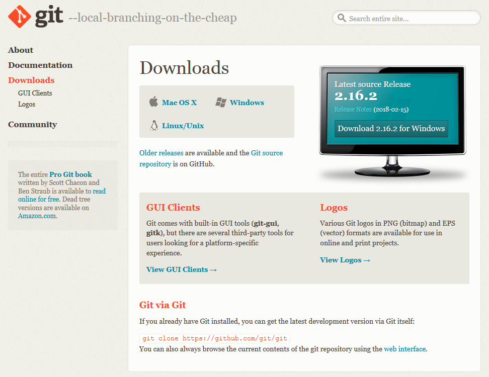
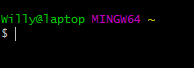

De eerste stap is de installatie van Git. Git is een open source versiebeheersysteem.  
Je kunt de software downloaden op deze website: http://git-scm.com/downloads.  
Kies de download link voor jouw besturingssysteem. Installeer de software en neem de default opties over.  
   
   

   
   
Open na installatie het programma Git Bash. Met Git Bash kun je vanaf de command line werken met Git.    
   
   

   
   
Vraag een overzicht op van de globale variabelen van Git:

`$ git config --list`

Check `user.name` en `user.email`. Pas de waarden aan als de variabelen leeg zijn of onjuist.

`git config --global user.name "Jouw naam"`  
`git config --global user.email naam@domein.nl`

Het is belangrijk dat deze variabelen op goede waarden bevatten. Elke commit wordt getagt met behulp van deze variabelen. Als je 'commit' sla je de status van je project op in Git.

[Volgende](2-aanmaken-van-een-github-account.md)