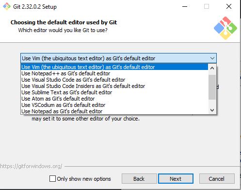

De eerste stap is de installatie van Git. Git is een open source versiebeheersysteem.

### Git downloaden

Je kunt de software downloaden op deze website: <a href="http://git-scm.com/downloads" target="_blank">http://git-scm.com/downloads</a>  
Kies de download link voor jouw besturingssysteem.  


### Git installeren

Wanneer je zelf nog niet bekend (genoeg) bent met git, kan je overal de default opties overnemen.  

Het is eventueel handig de git editor vast zelf te kiezen, al kan de gekozen editor altijd later nog aangepast worden.  
De editor wordt o.a. gebruikt om commit messages te wijzigen.  
In de Windows installatie krijg je daarvoor de volgende opties te zien:



   
#### Na de installatie:

**Windows**: Open het programma Git Bash. Met Git Bash kun je vanaf de command line werken met Git.    
   
**Mac & Unix**: Open een terminal

Controleer dat Git correct geïnstalleerd is door `git` te typen in de terminal. Dit zou de standaard git hulp moeten printen.
```
$ git
usage: git [--version] [--help] [-C <path>] [-c <name>=<value>]
           [--exec-path[=<path>]] [--html-path] [--man-path] [--info-path]
           [-p | --paginate | -P | --no-pager] [--no-replace-objects] [--bare]
           [--git-dir=<path>] [--work-tree=<path>] [--namespace=<name>]
           [--super-prefix=<path>] [--config-env=<name>=<envvar>]
           <command> [<args>]

These are common Git commands used in various situations:

...

'git help -a' and 'git help -g' list available subcommands and some
concept guides. See 'git help <command>' or 'git help <concept>'
to read about a specific subcommand or concept.
See 'git help git' for an overview of the system.
```
   

### Git configureren

Vraag een overzicht op van de globale variabelen van Git:

`$ git config --list`

Check `user.name` en `user.email`. Pas de waarden aan als de variabelen leeg zijn of onjuist.

`git config --global user.name "Jouw naam"`  
`git config --global user.email naam@domein.nl`

Het is belangrijk dat deze variabelen op goede waarden bevatten. Elke commit wordt getagt met behulp van deze variabelen. 
Als je 'commit' sla je de status van je project op in Git.  
De `user.name` is vrij te kiezen, maar wanneer je een platform zoals Gitlab of Github gebruikt moet de `user.email` gelijk zijn aan het 
emailadres waarmee je op dat platform geregistreerd bent. 

[Volgende](2-aanmaken-van-een-github-account.md)