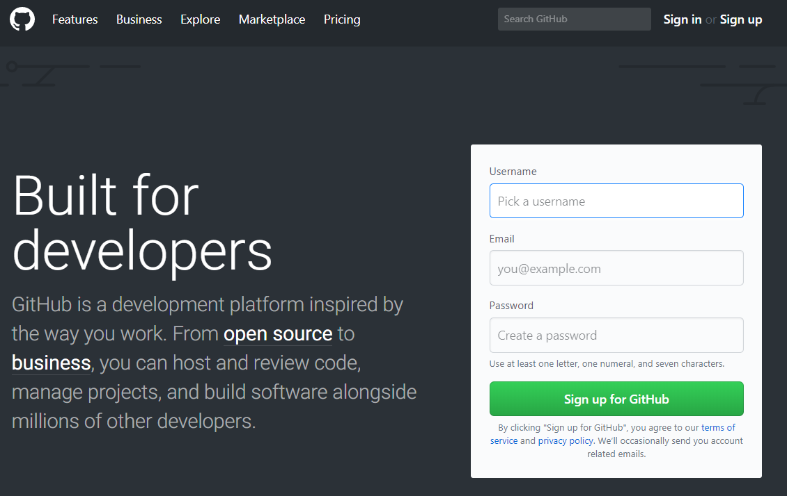
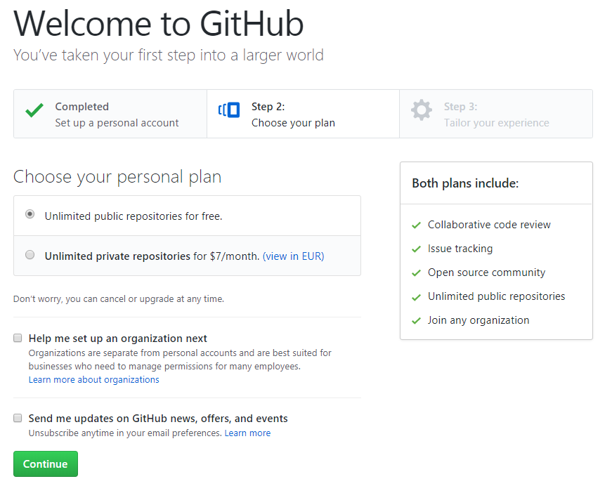
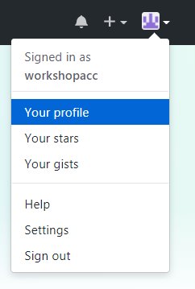
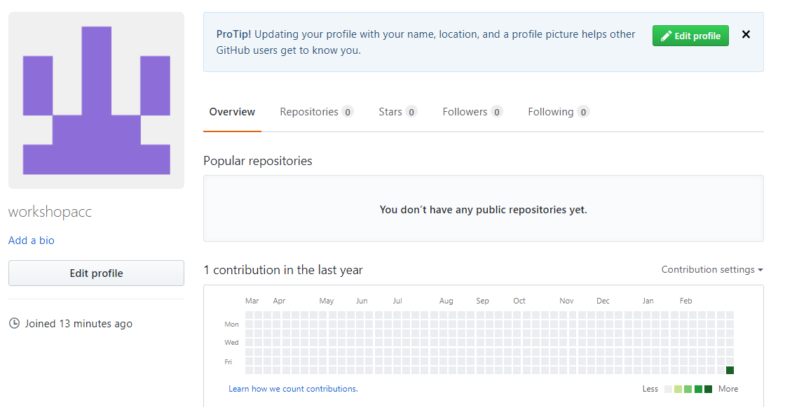

De volgende stap is het aanmaken van een GitHub account.  
GitHub is een samenwerkingsplatform in de cloud voor ontwikkelaars. GitHub is gebaseerd op het Git versiebeheersysteem.  

Ga naar de GitHub homepage: https://github.com  
Geef een gebruikersnaam, e-mailadres en wachtwoord op en klik op **Sign up for GitHub**.  
Let op: gebruik hetzelfde e-mailadres dat je geconfigureerd hebt in Git!  
   
   

   
   
Kies voor **Unlimited public repositories for free** en klik op **Continue**.  
   
   

   
   
Beantwoord op de volgende pagina eventueel wat vragen over je zelf of klik op **skip this step**.  

Klik op het icoontje in de rechter bovenhoek om het menu te openen.  
Kies voor **Your profile** om je GitHub profiel te bekijken.  
   
   

   
   
Als je dat wilt, kun je je profiel aanvullen. Klik hiervoor op **Edit Your Profile**.  
   
   

   
   
Check je mailbox. Als het goed is, heb je een mail van GitHub ontvangen met als onderwerp 'Please verify your email adress'.   
Verifieer je e-mailadres door op de link in de mail te klikken. Dit is nodig, anders kun je in de volgende stap geen repository aanmaken.