Je gaat nu een nieuwe repository aanmaken. Dit gaat in twee stappen.   
Eerst maak je de remote repository aan op GitHub. Vervolgens maak je een lokale kopie op je computer.     
Wijzigingen voer je eerst door op je lokale kopie en 'push' je dan naar de remote repository op GitHub.

## Stap 1: GitHub repository aanmaken
   
Ga naar https://github.com/jouwGebruikersnaam
   
Zorg er voor dat je bent ingelogd op GitHub.
   
Klik op het plus-teken in de rechter bovenhoek.  
Kies in het menu voor **New repository**.  
   
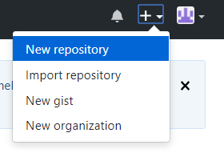
   
Geeft de nieuwe repository een naam en omschrijving.  
Maak de repository openbaar (**public**).  
Vink de volgende optie aan: **Initialize this repository with a README**.  
Klik vervolgens op **Create repository**. 
   
   
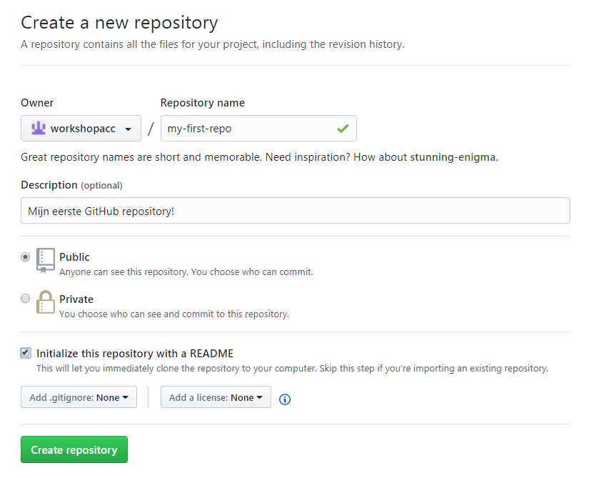
   
   
Je hebt zojuist je eerste GitHub repository aangemaakt :-)
   
   
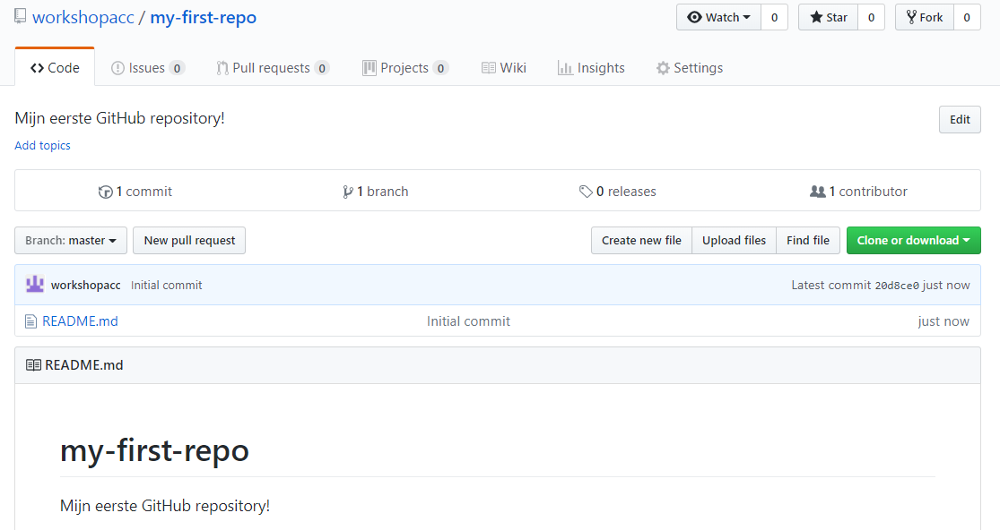
   
   
## Stap 2: Lokale kopie aanmaken

Open Git Bash.  
Navigeer naar de map waar je de repository wilt opslaan.   
Gebruik hiervoor het volgende commando:   
   
`$ cd "D:/Jouw map naam"`

Check de hyperlink naar de remote repository die je in de vorige stap hebt aangemaakt op GitHub.   
Die hyperlink is als volgt opgebouwd: https://github.com/jouwGebruikersnaam/jouwRepositorynaam.git.   
Je kunt de hyperlink eenvoudig kopiëren in de webpagina van jouw GitHub repository.   
Klik op **Clone or download** en kopieer de hyperlink die vervolgens getoond wordt.   

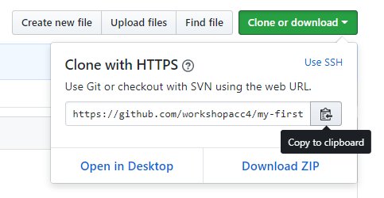
   
   
Ga terug naar Git Bash.   
Kopieer de remote repository naar je lokale computer met het volgende commando:   

`$ git clone https://github.com/jouwGebruikersnaam/jouwRepositorynaam.git`   
   
   
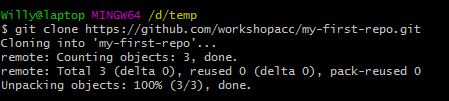

## Stap 3: Wijzigingen doorvoeren in de repository

Je kunt nu de lokale repository aanpassen.   
Je kunt mappen aanmaken en bestanden toevoegen.   
Hiervoor kun je gewoon de Verkenner of andere programma's gebruiken.   

Het is ook slim om de README.md aan te passen.   
De inhoud van dit bestand wordt namelijk getoond aan bezoekers van de webpagina van je GitHub repository.   
Dan is het handig als de README.md wat meer informatie bevat over de inhoud van de repository.   

README.md is een markdown bestand.   
Markdown is net als HTML een taal voor het opmaken van webpagina's, maar dan een stuk eenvoudiger.   
Klik hier voor een [Markdown Cheatsheet](https://github.com/adam-p/markdown-here/wiki/Markdown-Cheatsheet).   

Open de README.md in een teksteditor en pas de inhoud aan.   
Voeg eventueel een map en wat nieuwe bestanden toe aan je lokale repository.  

Ga terug naar Git Bash.   
Navigeer naar de lokale repository.   

`$ cd "D:/Jouw map naam/Jouw repository naam"`

Vraag een overzicht op van de veranderingen in de repository ten opzichte van de vorige commit.   
Dit doe je met behulp van het volgende commando:

`$ git status`
   
   
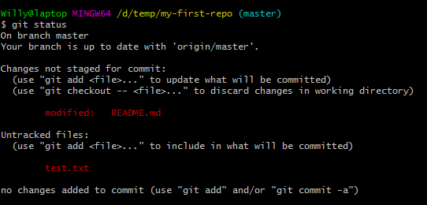

In het rood zie je de wijzigingen.
Zorg er voor dat alle wijzigingen worden klaargezet voor de commit:
    
`$ git add -A`
   
Voer nogmaals het `git status` commando uit om te verifiëren dat alle wijzigingen worden meegenomen in de commit.
   

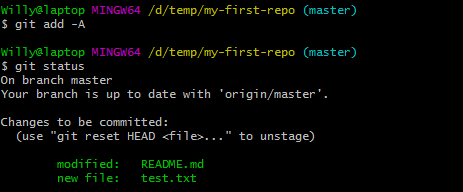   
   
    
Voer nu een commit uit. Hiermee maak je de wijzigingen definitief.   
Geef tussen de aanhalingstekens een korte beschrijving van de aard van de wijzigingen.
   
`$ git commit -m "Mijn eerste aanpassingen"`
   

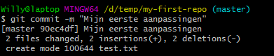   
   
    
Voer nogmaals het `git status` commando uit.   
Merk op dat je nu een melding krijgt dat je lokale repository voorloopt op de remote.
   

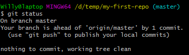   
      
   
Je kunt nu nog meer bestanden aanpassen of toevoegen.   
Vergeet niet om iedere keer een `git add` en `git commit` commando uit te voeren om de wijzigingen definitief te maken en klaar te zetten voor de remote repository!
 
Als je zo ver bent, kun je alle commits van de lokale repository naar de remote repository op Github pushen:
   
`$ git push`
   

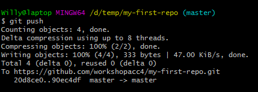   

Voer nog een laatste maal het `git status` commando uit.   
Merk op dat de lokale en remote repository weer met elkaar synchroon lopen.
   

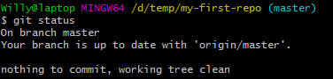    
   

Controleer of de remote repository op Github is aangepast.

[Volgende](4-bijdragen-aan-een-repository-van-een-ander.md)