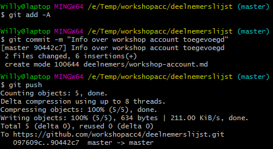
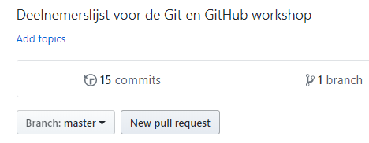

# Werken met een geforkte repository

Je gaat nu een kopie maken van een bestaande repository op GitHub en deze aanpassen.    
Het gaat om een eenvoudig project: een overzicht van deelnemers aan deze workshop.   

## Stap 1: GitHub/Gitlab repository forken

Ga naar de repository die je wil forken (bijvoorbeeld deze workshop repo) en klik de *fork* knop rechtsbovenin.      
Zie ook: [Repository forken](./fork-repository.md)
   
   
## Stap 2: Lokale kopie aanmaken

De volgende stap is om een lokale kopie van jouw fork te maken op je computer d.m.v. `git clone [URL]`.   
**Let op** :
pak de URL van de repo onder je eigen account, niet die van de oorspronkelijke repo.

Zie ook: [Een repository clonen](./git-clone-repository.md)

## Stap 3: Wijzigingen doorvoeren in de repository

Maak een kopie van het bestand `deelnemers/willy-tadema.md`.    
Hernoem het bestand en pas de inhoud aan in een teksteditor, zodat het bestand een aantal wetenswaardigheden over jou bevat.     
Je kunt eventeel een afbeelding toevoegen. Plaats dit bestand in de map `images` en zorg er voor dat je de verwijzing in het markdown bestand aanpast.    
Open het bestand README.md. Voeg een extra bullet toe met jouw naam en een verwijzing naar het bestand dat je zojuist hebt aangemaakt.   

Ga terug naar Git Bash.    
   
Zet de wijzigingen klaar voor de commit:    
    
`$ git add -A`
   
Voer vervolgens de commit uit:    

`$ git commit -m "Info over <jouw naam> toegevoegd"`    
   
Push je lokale commit naar je remote repository op GitHub:    
   
`$ git push`
   
   

   
 
Verifieer dat de deelnemerslijst in je remote repository op GitHub nu gegevens over jou bevat en dat de verwijzingen goed werken.    

## Stap 4: Pull request aanmaken

Je gaat nu een pull request aanmaken om de beheerders van de 'upstream' repository van Kennisnetwerk Data Science te verzoeken jouw aanvullingen door te voeren in hun repository.    
   
Ga naar https://github.com/jouwGebruikersnaam/deelnemerslijst.    
   
Zorg er voor dat je bent ingelogd op GitHub.    

Klik op **New pull request**.
    
    

   

Je krijgt nu een scherm te zien met daarin de wijzigingen in jouw repository ten opzichte van die van Kennisnetwerk Data Science.     
Merk op dat de beschrijving die je hebt meegegeven in je `git commit` commando zichtbaar is in dit scherm.   
Klik op de knop **Create pull request**.    
     
    

   
    
Geef een onderwerp en beschrijving op voor je pull request.    
Klik op de knop **Create pull request**.    

    

   

Wacht nu tot één van de GitHub beheerders van Kennisnetwerk Data Science je wijzigingen toevoegt aan de originele repository met een **Merge pull request**.    

[Volgende](5-conflicten-oplossen-en-voorkomen.md)
