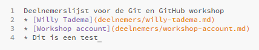
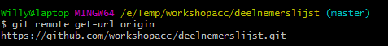
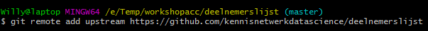
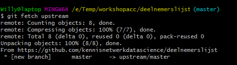
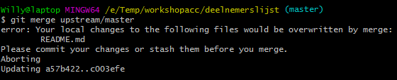
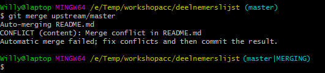
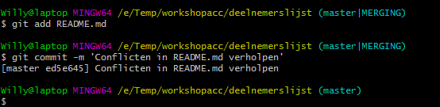
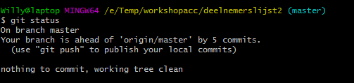

Pas het README.md bestand op je laptop aan. Voeg bijvoorbeeld een extra bullet toe met een tekstje.     
Voer nog geen commit uit!
    
    

   

Wacht tot een aantal van de pull requests van deelnemers van de worskhop is samengevoegd met de repository van Kennisnetwerk Data Science.     

Het README.md bestand in de repository van Kennisnetwerk Data Science bevat nu waarschijnlijk veel meer deelnemersnamen dan de lokale versie op je computer.    
Je lokale bestanden lopen dus achter op die in de 'upstream' repository.    
Hoe zorg je er voor dat je lokale repository alle wijzigingen in de deelnemerslijst bevat. Niet alleen je eigen, maar ook die van anderen?  

## Stap 1: Upstream remote aanmaken

De eerste stap is het aanmaken van twee aliassen ('remotes'):      
* `origin` die verwijst naar de deelnemerslijst repository onder je eigen GitHub account en      
* `upstream` die verwijst naar de deelnemerslijst repository van Kennisnetwerk Data Science.     

Check welke remotes al automatisch zijn aangemaakt door het volgende commando uit te voeren:

`git remote`
   
    

   

De remote `origin` is dus al aangemaakt.    
Check waarnaar `origin` verwijst met behulp van het volgende commando:      

`git remote-url origin`
   
    

   

`origin` verwijst inderdaad naar de deelnemerslijst repository onder je eigen GitHub account.

Maak nu de remote `upstream` aan met het volgende commando:

`git remote add upstream https://github.com/kennisnetwerkdatascience/deelnemerslijst`     
   
    

   

Verifieer dat de remote is aangemaakt en naar de juiste repository verwijst:

`git remote get-url upstream`
   
    

   
## Stap 2: Upstream en lokale repository samenvoegen

Haal nu de bestanden uit de upstream repository op. Dit doe je met een `git fetch` commando:
     
`git fetch upstream`   
        
       

        
     
Voeg vervolgens deze bestanden vervolgens samen met die in de lokale repository:

`git merge upstream/master`
       
       

        
     
Ai! Het commando wordt afgebroken. Er zijn geen wijzigingen doorgevoerd.     
In de waarschuwing die je krijgt, staat de reden:      
als je nu een `git merge` commando doorvoert, raak je de aanpassingen in je lokale README.md bestand kwijt!     
         
       
Commit de wijziging in de README.md in je lokale repository:

`git add README.md`   
`git commit -m "Een extra regel in de README.md voor testdoeleinden"`    

Voer nogmaals het `git merge` commando uit:

`git merge upstream/master`     
       
       

        
     
Het samenvoegen is opnieuw niet gelukt. Er zijn namelijk conflicten in het README.md bestand.     
Git weet niet welke wijzigingen in het bestand je wilt behouden.    

## Stap 3: Conflicten oplossen

Open het README.md bestand.     
Git heeft automatisch regels toegevoegd aan het bestand om aan te geven waardoor het conflict wordt veroorzaakt.     
De veranderingen in de upstream repository staan onder de conflict marker `<<<<<<< HEAD`.     
Verderop zie je `=======`. Dit markeert de scheiding tussen wijzigingen in de upstream en lokale repository.     
`>>>>>>> upstream/master` geeft het eind van de conflicten aan.     
    
Pas nu het README.md bestand aan. Bepaal welke wijzigingen je wel of niet wilt behouden. Haal de conflict markers weg.

Commit vervolgens de wijzigingen:     

`git add README.md`     
`git commit -m 'Conflicten in README.md verholpen'`     
     
       

     
     
Vraag informatie over de status van je lokale repository op:

`git status`
     
       

     
     
Je krijgt nu een melding dat je lokale repository voorloopt op de deelnemerslijst repository onder je account op GitHub.     
Als je dat wilt, kun je de lokale repository naar de origin repository pushen, zoals we dat [aan het begin van de workshop](3-aanmaken-van-een-nieuwe-repository.md) ook gedaan hebben.

## Stap 4: Conflicten voorkomen

Het beste is natuurlijk om conflicten te voorkomen.    
Zorg er voor dat je lokale repository up-to-date is, voordat je wijzingen doorvoert.    
Voer daarom éérst een `git fetch` en `git merge` commando uit en ga daarna pas aan de slag met het wijzigen van je lokale repository.   

[Volgende](6-materiaal-voor-verdere-studie.md)