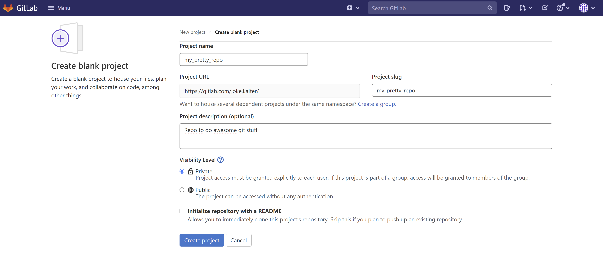
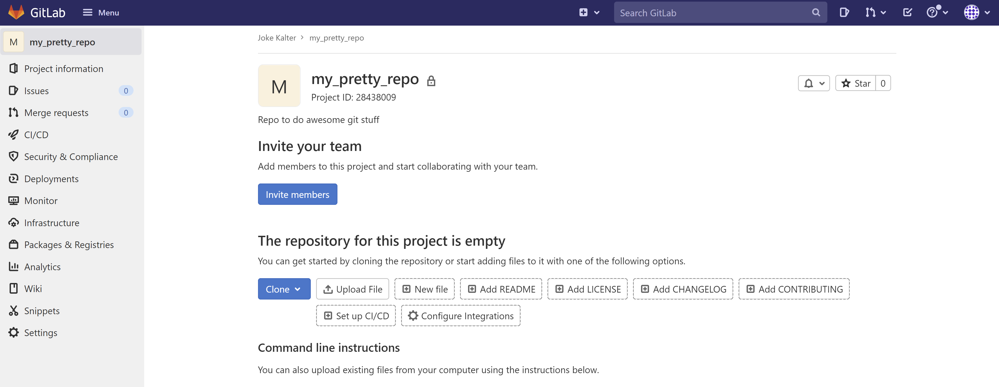

# Een nieuwe GitLab repository aanmaken
   
Ga naar https://gitlab.com/jouwGebruikersnaam
   
Zorg er voor dat je bent ingelogd op GitLab.
   
- Klik op het plus-teken in de bovenin.  
- Kies in het menu voor **New project/repository**. Wanneer je lid bent van 1 of meer groups, kan je de repo in een
  group aanmaken. Hierdoor is de repo makkelijker vindbaar voor je collega's in die group.   
- Kies de optie **create blank project**
   

   
- Geeft de nieuwe repository een naam en omschrijving.  
- Kies of je de repository openbaar (**public**) of afgeschermd (**private**) wilt houden.  
- Vink de volgende optie aan: **Initialize this repository with a README**. (Doe dit niet als je een bestaande repo wil pushen)
- Klik vervolgens op **Create project**. 
   
   

   
   
Je wordt doorgeleid naar je aangemaakte repo:   
   

   
   