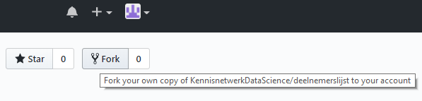
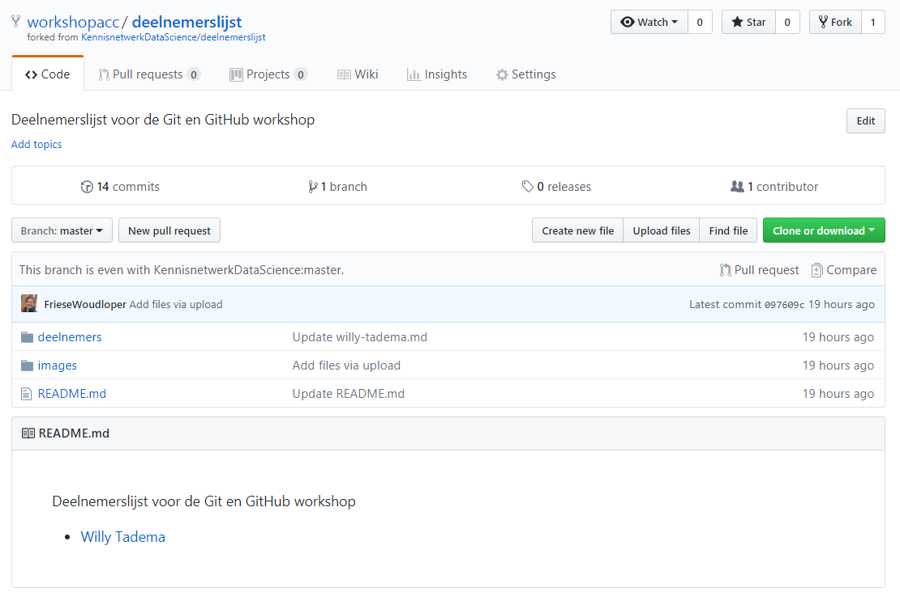
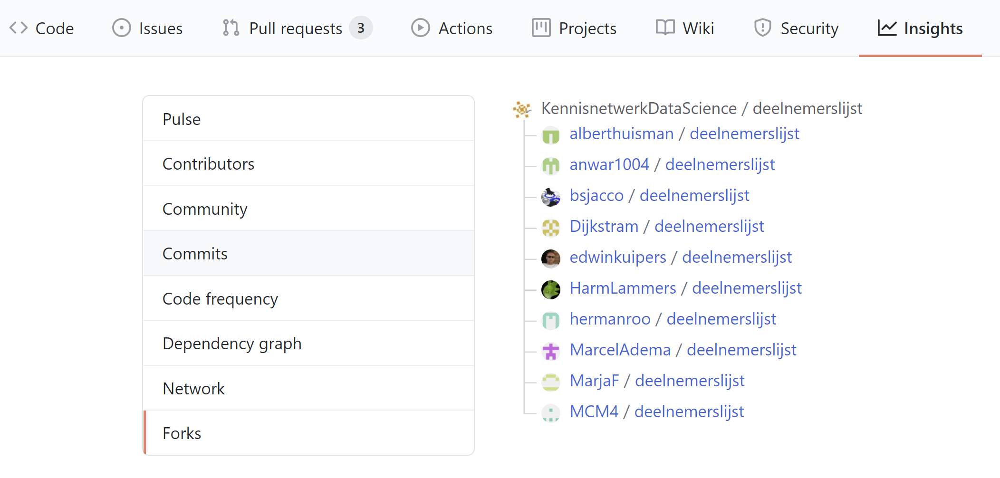

# Een bestaande repository kopiëren (forken)

Het kopiëren van een bestaande repository heet **forken**. Door een repository te forken, heb je zelf een kopie waarop je
admin rechten hebt en die je volledig kan wijzigen zonder dat je afhankelijk bent van de originele eigenaar.    
Je kan zowel je eigen als de oorsprongelijke repository [instellen als remote](./git-add-remotes.md). Hierdoor kan je zowel
zelf vrij ontwikkelen als bijdragen aan de oorspronkelijke repo. 
Doorgaans wordt de oorspronkelijke repository de **upstream** genoemd, jouw *fork* noem je **origin**. 

Forken wordt voornamelijk gebruikt wanneer je geen developer rechten hebt op een repo, maar er wel aan wil doorontwikkelen. 
Wanneer je samen met de originele eigenaar, bijvoorbeeld een collega, wilt werken aan de repository,
dan kan je de repo beter [clonen](./git-clone-repository.md) en developer of admin rechten instellen.

## Stappen om te forken
Zorg er voor dat je bent ingelogd op GitHub/Gitlab.    

Ga naar het project dat je wil forken.     
   
Klik op **Fork**. Deze knop vind je in de rechter bovenhoek van je scherm.    
    
    

   
   
GitHub: Het kan even duren, maar uiteindelijk wordt er een kopie van de repository aangemaakt onder jouw eigen gebruikersnaam.   
GitLab:  Na het klikken op *fork* krijg je een formulier te zien: Pas de projectnaam naar smaak aan, selecteer optioneel 
een namespace en selecteer het visibility level. Klik daarna op *Fork project*
   
Door op het getal achter *Fork* te klikken kan je inzien wie de repo allemaal geforked heeft 
(in GitLab is dit nummer alleen in de originele repo te zien)   
    
