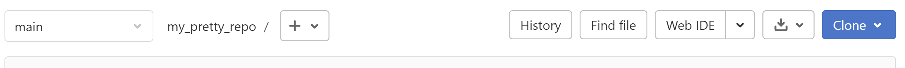
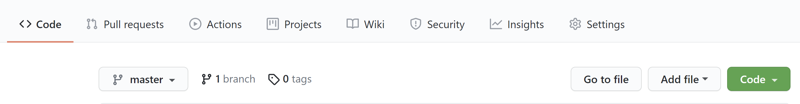

# Clone een repository 

Door een project te clonen worden alle bestanden van het project + de **.git/** folder op je computer beschikbaar en 
kan je deze openen en wijzigen met behulp van een IDE of andere programma's.   
Je kan elk beschikbaar project clonen; niet alleen projecten die door jou zelf zijn aangemaakt.   
Het wordt door de eigenaar(s) van een repository bepaald of andere mensen rechten hebben op de repo.

#### Stappen:
Open Git Bash.  
Navigeer naar de map waar je de repository wilt opslaan.   
Gebruik hiervoor het volgende commando:   
   
`$ cd "D:/Jouw map naam"`

Op de hoofdpagina van het project dat je wil clonen op Github of Gitlab vind je een 
dropdown menu knop:   
**Clone** (Gitlab)   
  
of **Code** (Github)    
  

In het clone dropdown menu kan je (o.a.) kiezen uit clonen met SSH of met HTTPS. Wanneer je nog geen ssh hebt ingesteld 
gebruikt je de HTTPS URL.   
   
   
Ga terug naar Git Bash.   
Kopieer de remote repository naar je lokale computer met het volgende commando:   

`$ git clone https://github.com/jouwGebruikersnaam/jouwRepositorynaam.git`   
   
   

