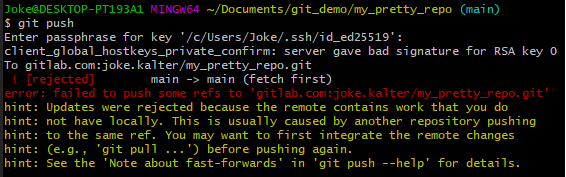

# Push lokale repo en/of lokale wijzigingen naar een remote

## Stel je remote repository in

Wanneer je voor het eerst pusht, kan het zijn dat de remote repository nog niet goed ingesteld is, zie 
[Stel 1 of meerdere remote repositories in](./git-add-remotes.md) om dit in te controleren en in te stellen.

## Push je repository

Nadat je [bestanden of wijzigingen hebt toegevoegd](git-add-and-commit-files.md) aan je lokale repository 
 en een [remote hebt ingesteld](./git-add-remotes.md), 
kan je je repository pushen:   
`git push origin main`   
oftewel:   
`git push [REMOTENAAM] [BRANCHNAAM]`

In het geval van een HTTPS remote URL, kan het zijn dat je je Gitlab/Github username en wachtwoord moet invoeren.   
In het geval van een SSH remote URL, kan het zijn dat je je passphrase van je ssh sleutel moet invoeren.

   

Voer het `git status` commando uit.   
Merk op dat de lokale en remote repository weer met elkaar synchroon lopen.
   

    
   

Controleer of de remote repository op Github is aangepast.

## Foutmeldingen
### No upstream branch
Je kan het commando `git push [REMOTENAAM] [BRANCHNAAM]` versimpelen naar enkel `git push`.
De eerste keer krijg je soms wel de volgende melding:   
```
fatal: The current branch main has no upstream branch.
To push the current branch and set the remote as upstream, use

    git push --set-upstream origin main
```

Git geeft hierbij direct een oplossing voor je probleem: `git push --set-upstream origin main`

Voor meer info, voer `git push --help` uit.

### Remote changes

Als er wijzigingen zijn in de remote branch, zul je eerst moeten *pullen* d.m.v. `git pull`, 
zie [hier](git-pull-from-remote.md) hoe je dat doet.




