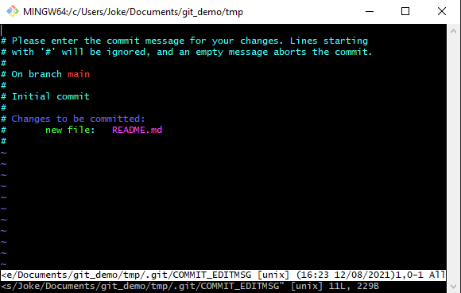

## Voeg bestanden toe aan je Git repo

Je gebruikt de commando's `add` en `commit` om bestanden en wijzigingen toe te voegen aan de Git repo.  

### De areas van een Git repo

  

**Working directory**: Plek waar je lokaal nieuwe bestanden/folders toevoegt of wijzigt.
De *.git/* folder staat in de hoofdfolder van je working directory. Bestanden en folders in en onder je hoofdfolder worden 
gedetecteerd als zijnde in de *working directory*.   
N.B.: Bestanden/folders die in een `.gitignore` bestand staan worden *niet* 
gedetecteerd in de *working directory*.  
**Staging area**: Plek om wijzigingen/toevoegingen van bestanden uit de *working directory* toe te voegen 
(te *stagen* of *adden*) om vervolgens te kunnen toevoegen aan de Git repository (te *committen*)  
**Repository**: Dit is de Git repository. De repository houdt bij welke bestanden er zijn en wanneer, hoe en door wie 
deze over tijd gewijzigd zijn. 

### Bestanden toevoegen aan de staging area (adden/stagen) 
Navigeer naar de lokale repository.   

`$ cd "/path/to/project/"`

Vraag een overzicht op van de veranderingen in de *working directory* t.o.v. de *staging area* en de *Git repository*.   
Dit doe je met behulp van het volgende commando:

`$ git status`
   
   

In het rood zie je de wijzigingen in de *Working directory*.  
In het geval van een nieuwe Git repo staan er alleen bestanden onder *Untracked files*.
Wanneer je bestanden die al bestaan in de Git repo wijzigt, zie je dit terug onder *Changes not staged for commit*

Om de bestanden en eventuele wijzigingen toe te voegen aan de Git repo, moeten deze eerst van de *Working directory* 
aan de *Staging area* toegevoegd worden. Dit doe je d.m.v. het commando `git add`   

Je kan ervoor zorgen dat **alle** wijzigingen en toevoegingen worden klaargezet voor de commit (`$ git add -A`), maar 
je kan ook kiezen om alleen wijzigingen (`git add -u`) of specifieke bestanden (`git add README.md`) toe te voegen.   
Voor een overzicht van alle mogelijkheden van git add kan je het commando `git add --help` uitvoeren.
   
Voer nogmaals het `git status` commando uit om te verifiëren dat alle wijzigingen toegevoegd zijn aan de *staging area* 
en worden meegenomen in de commit.
   

   
   

### Bestanden uit de staging area in de Git repository zetten (committen)

Voer nu een commit uit. Hiermee verplaats je je wijzigingen van de *staging area* naar de *repository* en maak je de 
wijzigingen dus definitief in de Git repository.    

Bij een commit moet je een *commitmessage* toevoegen: hiermee kan je aangeven wat je hebt gewijzigd. Dit maakt het 
makkelijker voor je collega's om te zien wat er is gewijzigd, maar ook voor jezelf als je later terugkijkt.  
Je kan een commitmessage direct meegeven bij het doen van een commit. Geef hiervoor de `-m` flag mee en zet je message 
erachter tussen de aanhalingstekens:
   
`$ git commit -m "Mijn eerste aanpassingen"`
   

   
    
   

#### Committen met de vim editor
Wanneer je enkel `git commit` uitvoert, wordt de default editor die je voor git gekozen hebt geopend.  
Wanneer je je default editor niet hebt aangepast is dit de *vim* editor:

  

Om je commitmessage te typen in *vim* en er weer uit te komen, doe je het volgende:   
- type `i` (insert)
- type je commit message
- type `esc` (ga uit de insert modus)
- type `:wq` (write & quit)

[HOME](../README.md)