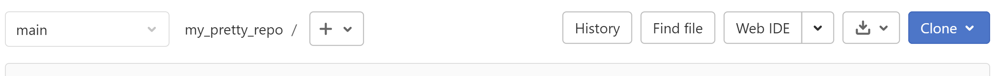
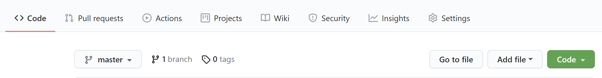

# Stel 1 of meerdere remote repositories in

## Controleer of je repository al een remote heeft    

Ga naar je projectdirectory:   
`cd /path/to/project/`   

Roep de ingestelde remotes in:   
`git remote -v`   
Als dit niks teruggeeft, dan heb je nog geen remote repository ingesteld. Anders zie je iets vergelijkbaar met dit:    
```
origin  git@github.com:[USERNAME]/[PROJECTNAAM].git (fetch)
origin  git@github.com:[USERNAME]/[PROJECTNAAM].git (push)
```  

Als de URLs inderdaad overeenkomen met het bedoelde project en de bedoelde bestemming (Gitlab/Github), dan kan je 
wijzigingen aan de repo [pushen](git-push-naar-remote-repo.md) d.m.v. `git push`.

## Voeg een remote toe aan je lokale repository
### Naamgeving van remotes
Het is best practice om de hoofdrepo waar je naar toe wil pushen *origin* te noemen (i.e. `git remote add origin [CLONE URL]`).
De term *upstream* wordt gebruikt 
in het geval van een [geforkte repository](fork-repository.md) om naar de oorspronkelijke repository te verwijzen. 
Wanneer je met een [geclonede repo](git-clone-repository.md) werkt die nooit geforked is, dan is je *upstream* gelijk 
aan je *origin*    

Daarnaast kan je vrij andere remotes toevoegen, bijvoorbeeld wanneer je je repository op zowel gitlab als github 
beschikbaar wilt stellen of voor verschillende organisaties/groups binnen hetzelfde platform. Je kan remotes ook weer verwijderen
of aanpassen, zie `git remote --help` voor alle opties.

Wanneer je je wijzigingen [pusht](git-push-naar-remote-repo.md) kan je de naam van de gewenste remote meegeven of je kan 
een flag toevoegen om tegelijk te pushen naar alle beschikbare remotes, zie: `git push --help`. 

### Toevoegen van een remote
Op de hoofdpagina van je project (e.g. `www.github.com/[USERNAME]/[PROJECTNAME]`) op Github of Gitlab vind je een 
dropdown menu knop:   
**Clone** (Gitlab)   
  
of **Code** (Github)    
  

In het clone dropdown menu kan je (o.a.) kiezen uit clonen met SSH of met HTTPS. Wanneer je nog geen ssh hebt ingesteld 
gebruikt je de HTTPS URL.   
Kopieer de URL en ga naar je Git Bash:   
`git remote add [REMOTE NAAM] [CLONE URL]`   


Controleer of je remote is toegevoegd voor zowel `push` als `fetch`:   
`git remote -v`   
Je ziet iets vergelijkbaar met dit:    
```
origin  git@github.com:[USERNAME]/[PROJECTNAAM].git (fetch)
origin  git@github.com:[USERNAME]/[PROJECTNAAM].git (push)
```  

[HOME](../README.md)