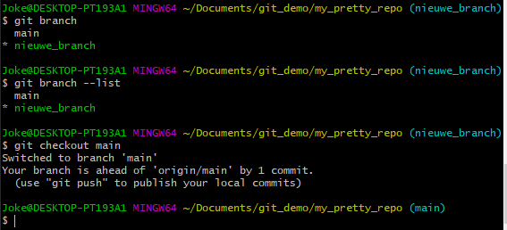

# Een branch aanmaken

Branches worden gebruikt om losstaande stukken functionaliteit te kunnen ontwikkelen en testen. Door deze functionaliteit
in een aparte branch te zetten zit je je mede-ontwikkelaars niet in de weg met het pushen van veel losse commits. Zie het 
als het samen maken van een verslag: Iedereen typt een hoofdstuk, maar je wil niet elke regel die je typt direct delen met 
anderen. 

Een branch is een aftakking van een versie van de repo. Het is gebruikelijk nieuwe branches af te takken vanaf de hoofdbranch
(e.g. *main* of *master*). Het is ook mogelijk om een branch af te takken vanaf een sub-branch. Dit laatste is handig als je
wilt doorwerken op een stuk functionaliteit dat jij of een mede-ontwikkelaar al gebouwt heeft in een branch.

1. Ga naar de branch vanaf waar je een nieuwe branch wil aanmaken, e.g. *main*, d.m.v. `git checkout [branch]`    

`git checkout main`    

Je kan de lijst met bestaande branches zien door `git branch` of `git branch --list` uit te voeren   

   

2. Zorg dat de branch waar je van aftakt up to date is door te [pullen](git-pull-from-remote.md) met `git pull`

3. Maak een nieuwe branch aan   

Je kan een nieuwe branch aanmaken d.m.v.:   
`git branch [nieuwe_branch_naam]`    
e.g.: `git branch nieuwe_feature` (zorg ervoor dat er geen spaties in de naam staan)

Je kan vervolgens naar je branch toe d.m.v.:    
`git checkout nieuwe_feature`    

Alternatief kan je een nieuwe branch aanmaken en direct uitchecken d.m.v.:     
`git checkout -b [nieuwe_branch_naam]`

[HOME](../README.md)