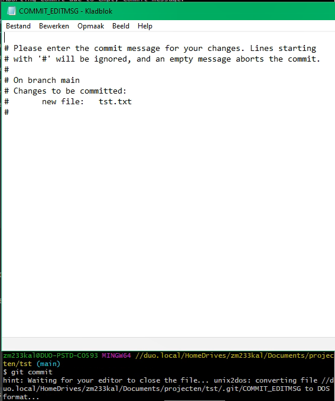

# Git tekst editor
Bij sommige acties, bijvoorbeeld wanneer je enkel `git commit` uitvoert i.p.v. `git commit -m "message"`, wordt de default 
tekst editor van git geopend.  
Wanneer je je default editor niet hebt aangepast is dit de *vim* editor:

  

Om de default editor op Windows te veranderen naar de standaard notepad kan je het volgende commando gebruiken:

`git config --global core.editor notepad`

Voor een overzicht van andere editors en/of andere operating systems, [zie deze link](https://git-scm.com/book/en/v2/Appendix-C%3A-Git-Commands-Setup-and-Config).

## Werken met de vim editor
Om je commitmessage te typen in *vim* en er weer uit te komen, doe je het volgende:   
- type `i` (insert)
- type je commit message
- type `esc` (ga uit de insert modus)
- type `:wq` (write & quit) gevolgd door enter

## Werken met andere editors

Wanneer je bijvoorbeeld met de Windows notepad werkt, krijg je het volgende te zien wanneer deze bij een commit of merge
geopend wordt:

Om verder te komen doe je het volgende:
- Type of wijzig je commitmessage op de eerste regel. In het geval van een merge is de commitmessage automatisch 
  gegenereerd en kan je deze ongewijzigd laten.
- Sla het bestand op
- Sluit het bestand af
- De commandline detecteert automatisch dat de commitmessage ingevuld is 

[HOME](../README.md)