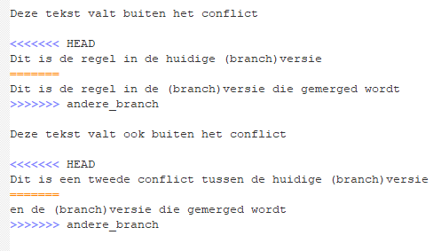
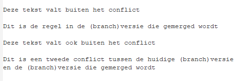

# Merge conflict

Wanneer er meerdere wijzigingen plaatsvinden op dezelfde plek in hetzelfde bestand, dan weet Git niet welke wijziging
behouden moet worden en kan Git deze wijzigingen niet meer automatisch samenvoegen. Dit noemen we een *merge conflict*. 
*Merge conflicten* kunnen ontstaan wanneer je twee verschillende branches merged, maar ook wanneer je wijzigingen [pullt](git-pull-from-remote.md).


Alle merge conflicts hebben een vergelijkbare vorm en werkwijze.

1. Git verteld je dat er een conflict is en in welk bestand het conflict is.    
*master|MERGING* geeft aan dat je nog bezig bent met mergen. 


Wanneer je `git status` runt zal dit ook aangeven dat je bezig bent met een merge en wat je vervolgstappen zijn: oplossen
of annuleren.

```bash
You have unmerged paths.
  (fix conflicts and run "git commit")
  (use "git merge --abort" to abort the merge)
```

2. Ga naar het bestand om het conflict te zien.    
   Er kunnen één of meerdere conflicten in het bestand zitten.    
   Git heeft automatisch regels toegevoegd aan het bestand om aan te geven waardoor het conflict wordt veroorzaakt.     
   De veranderingen in de huidige (versie van de) branch gaan vooraf met: `<<<<<<< HEAD`.     
   Verderop zie je `=======`. Dit markeert de scheiding tussen wijzigingen in de huidige versie en de te mergen versie.     
   `>>>>>>> andere_branch` geeft het eind van de wijzigingen in de 'andere branch' aan.

Bijvoorbeeld:   


3. Kies welke versie je wil bewaren en verwijder de andere versie. Je kan ook beide wijzigigen houden door ze op
   verschillende regels te behouden. Het voornaamste is dat je de conflict markeringen
   (`<<<<<<< HEAD ====== >>>>>>> andere_branch`) verwijdert.

Bijvoorbeeld:   


4. Voeg de wijzigingen toe aan de merge commit waar je aan werkt d.m.v. `git add -u` of `git add [filename]`

5. Maak de merge af met een `git commit`. Het *commitmessage* is hierbij optioneel, omdat deze automatisch gegenereerd wordt.
   Wanneer je enkel `git commit` runt in een merge, zal er een commitmessage voorgesteld worden in je default tekst editor. 
   Wanneer je de default editor niet hebt aangepast is dit de *vim* editor:

     

   Voor meer informatie, zie: [git commit](git-add-and-commit-files.md) en [Git tekst editor gebruiken](./git-editor.md)
   

[HOME](../README.md)