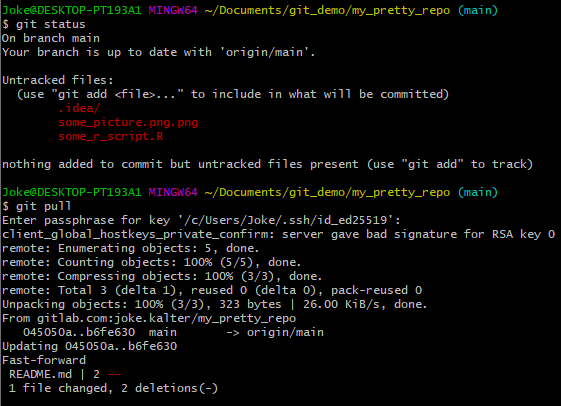
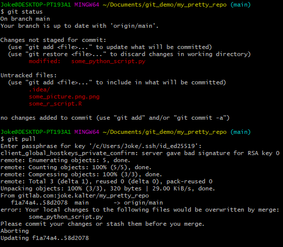
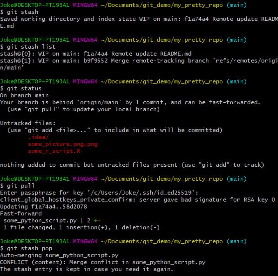

# Remote wijzigingen in je lokale repo krijgen

Wanneer je samenwerkt aan dezelfde remote repo, kan het zijn dat je collega iets heeft [gepusht](git-push-naar-remote-repo.md)
naar de branch waar jij ook op werkt, bijvoorbeeld de hoofdbranch *main*. Om deze wijzigingen lokaal te krijgen kan je 
een aantal dingen doen, we bespreken hier alleen de `git pull` optie.   

Een andere gebruikelijke optie is `git fetch` + `git merge`, zie [documentatie voor meer info](https://www.atlassian.com/git/tutorials/syncing/git-fetch) 

## Git pull

### Zonder lokale wijzigingen
Wanneer je *working directory* leeg is en je niks hoeft te pushen, is het `git pull` commando vrij simpel.

- Kijk of je working directory leeg is met `git status`
- gebruikt `git pull` om de remote wijzigingen lokaal te krijgen. `git pull` pakt hier de default remote, je kan optioneel
ook de remote alias en branch naam meegeven, e.g. `git pull origin main`. 



### Met lokale wijzigingen

Wanneer je wijzigingen probeert te *pullen* terwijl je in dezelfde bestanden lokaal wijzigingen hebt gemaakt, krijg je de
volgende melding:
```bash
error: Your local changes to the following files would be overwritten by merge:
        some_python_script.py
Please commit your changes or stash them before you merge.
```



Wanneer je klaar bent je lokale wijzigingen te *committen*, dan kan je deze stappen volgen:
[git add en commit](git-add-and-commit-files.md)   
Hierna kan je opnieuw `git pull` uitvoeren. Het kan zijn dat je dan met een [merge conflict](git-merge-conflict.md) te maken krijgt.

#### Git stash
Alternatief kan je, zoals de foutmelding aangeeft, je wijzigingen *stashen* d.m.v. `git stash`.
Hiermee bewaar je je lokale wijzigingen in een *stash* wordt je *working directory* leeg, waardoor je remote wijzigingen
ongestoord kan *pullen*.

- `git stash`: bewaar wijzigingen in de stash. Geef eventueel een omschrijving mee als je iets voor langere tijd wil 
  stashen: `git stash save "omschrijving"`
- `git stash list`: laat de lijst met gestashte wijzigingen zien. *stash@{0}* is het laatste dat je gestasht hebt.
- `git stash pop`: Haal de laatste wijzigingen (*stash@{0}*) uit de stash en naar je *working directory*. Je kan ook de 
  index van de gewenste wijzigingen meegeven, e.g. `git stash pop 1` voor *stash@{1}* 
  (Je kan hierna alsnog een [merge conflict](git-merge-conflict.md) krijgen, maar je hoeft deze na het oplossen niet direct te *committen*, 
  i.t.t. conflicts die direct uit `git pull` voortkomen)   




[HOME](../README.md)