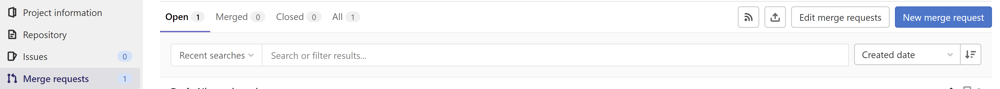
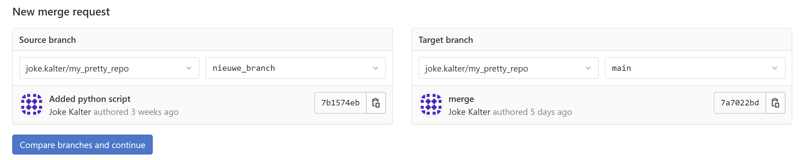
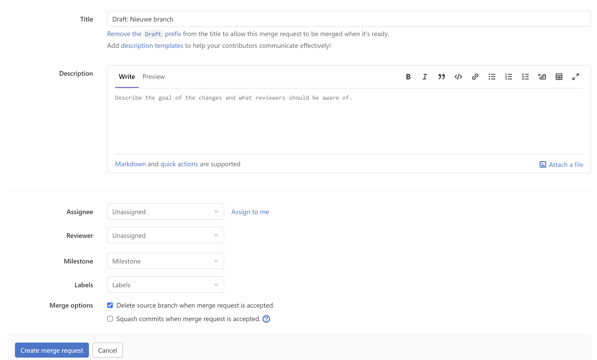
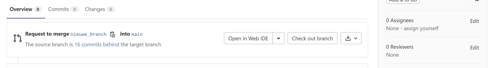
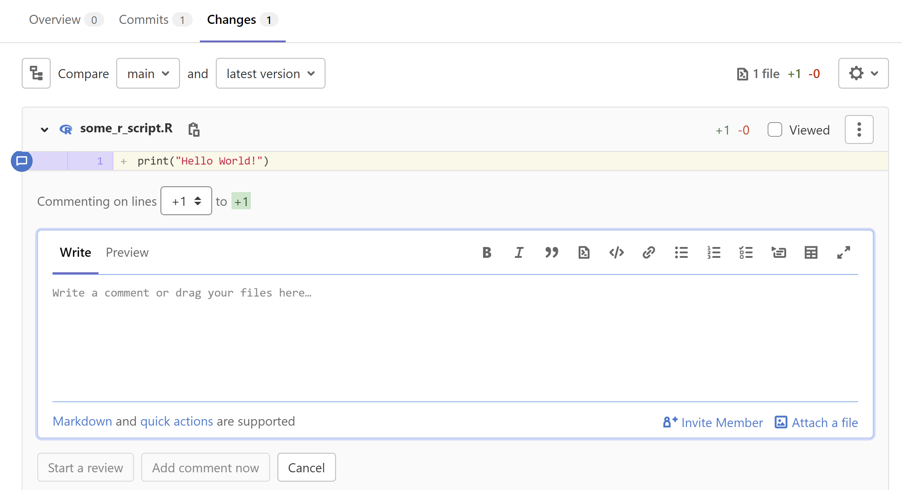
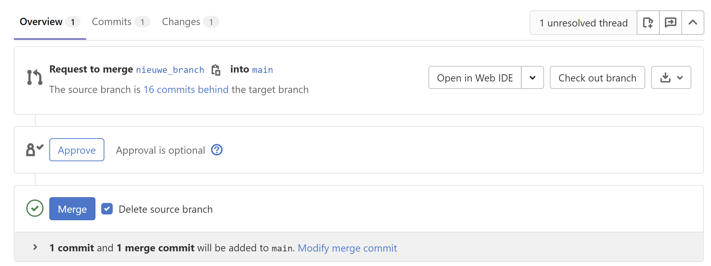
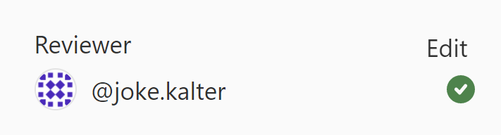

# Een merge request openen op GitLab

Een pull request (github) of merge request (gitlab) wordt gebruikt om de functionaliteit van de ene branch op een gecontroleerde manier 
samen te voegen met een andere branch. Het gecontroleerde zit in het volgende: Bij het maken van de merge request wordt
een overzicht gegeven van de verschillen tussen de 2 branches. Zo kan je goed controleren of je inderdaad alleen wijzigingen
hebt aangebracht op de plekken waar je wijzigingen wou maken. Het komt soms voor dat je per ongeluk iets verwijderd hebt,
of juist iets hebt toegevoegd wat niet in de repo hoort - zoals data of een hardcoded path.   
Naast dat je zelf kan controleren of je de juiste aanpassingen hebt gemaakt, kan je ook aan een mede-ontwikkelaar vragen
of die wil kijken naar jouw code. Die persoon kan dan controleren op fouten, tips geven over andere implementaties of
vragen stellen over je aanpak. Hiermee zorg je ervoor dat het werk dat uiteindelijk in de hoofdversie van je repo komt
goed werkt, 'schoon' is en daardoor overdraagbaar is naar, en reproduceerbaar voor, andere personen. Daarnaast zorgt een merge request ook voor 
onderlinge kennisuitwisseling over lopende projecten en gebruikte technieken.

De branch waar je in ontwikkeld hebt en die je wil mergen is de **source branch**   
De branch waar je naartoe wil mergen is de **target branch**

## Een merge request aanmaken

- Ga in GitLab in je repo naar het tabblad *Merge requests* en klik op de blauwe knop: *New merge request*

- Kies je target en source branch

  

- Geef een titel (zonder *Draft:*) en een beschrijving op voor je merge request.    
- Selecteer eventueel alvast de reviewer(s)
- (de)selecteer merge opties afhankelijk van gemaakte afspraken in het team  
- Klik op de knop **Create merge request**.    

   

## Een merge request (laten) reviewen

- Op de pagina van je merge request kan je aan de rechterkant één of meerdere 
  reviewers kiezen door op *Edit* achter *Reviewers* te klikken. Zorg ervoor dat de reviewers toegang en rechten hebben
  op je repo.    
Hoeveel reviewers je kiest hangt af van de afspraken die je in je team maakt en de instellingen van je repository.
  

Onder het tabblad *Changes* vind je het eindresultaat van alle commits in de branch. Oftewel, de veranderingen
waarvan gevraagd wordt deze te mergen in de **target branch**. Op het tabblad *commits* kan je individuele commits inzien.

- Wanneer je een vraag, tip, suggestie of opmerking hebt over een wijziging, dan kan je over de regel heen hoveren en
  op het praatwolk teken aan het begin van de regel klikken om een comment toe te voegen. Je kan ervoor kiezen een 
  *single comment* toe te voegen of een *review* te starten. 
  Wanneer je meerdere bestanden moet reviewen en je in één keer al je commentaar wil overbrengen, 
  dan kies je voor een *review*, wanneer er weinig wijzigingen zijn of als je niet alle
  wijzigingen langs zult gaan kan je ook een enkel comment achterlaten. Hierover kan je afspraken maken in je team en/of 
  je persoonlijke voorkeur aanhouden.

  

- Om de persoon die de merge request geopend heeft te laten weten dat je klaar bent met je review kan je een losse comment
  op de *Overview* pagina plaatsen of je kan de merge *approven* met de approve knop.    
  De meeste teams houden hierbij het volgende onderscheid aan:   
  Met *Approve* geef je aan dat je erop vertrouwt dat PR-opener jouw commentaar goed verwerkt en dat de branch gemerged 
  mag worden zodra jouw feedback verwerkt is .   
  Zonder approve geef je aan dat je na het verwerken van jouw feedback nog een blik wil werpen op de wijzigingen
  alvorens je je approval geeft.

  

## Een merge request mergen

- Voor je een merge request merged is het best practice om, naast het verwerken van feedback, ook te reageren op alle comments.
  Hiermee maak je voor de reviewer duidelijk dat je alle comments gezien en overwogen hebt. Reacties kunnen variëren
  van een uitgebreide uitleg over de keuzes die je hebt gemaakt tot een duimpje omhoog of like als leesbevestiging.
  Aanvullend heeft GitLab de optie om *Resolve thread* te klikken bij een opmerking en wordt het aantal *unresolved threads*
  gemonitord.
  Ook hierover kunnen afspraken gemaakt worden in het team.

- Je kan rechts in het *Overview* scherm zien wanneer de reviewers klaar zijn met de review en de wijzigingen 
  *approved* hebben (groen vinkje). 
  

- Onderin het *Overview* scherm kan je je merge request mergen. Er wordt aangegeven of er [merge conflicts](./git-merge-conflict.md)
  zijn d.m.v. een groen vinkje of kruis voor de *Merge* knop. Als er conflicten zijn, dan moet je die eerst oplossen 
  voor de branch gemerged kan worden.    
  Wanneer je niet zo bekend bent met Git kan je bij het mergen van de merge request voor de default opties kiezen en
  gewoon op de *Merge* knop klikken.    
  Als je opties gedeselecteerd hebt kan je altijd in een later stadium nog branches verwijderen of commits rebasen. 
  Ook daarover kan je in je team afspraken maken.
  
  

Je branch is nu gemerged in de target branch! 
Vergeet de target branch niet lokaal te [pullen](./git-pull-from-remote.md).
